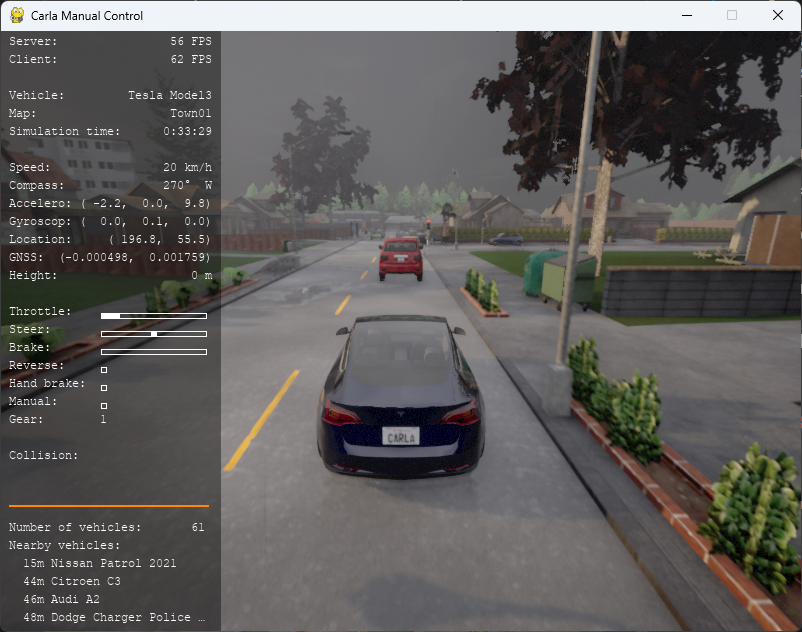
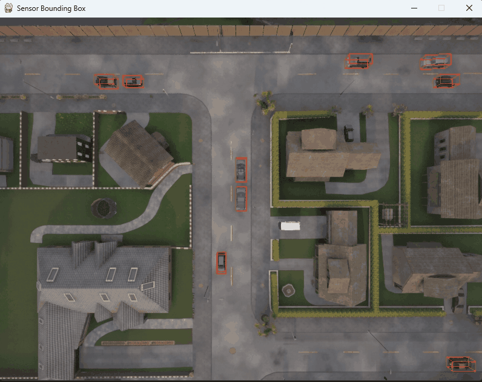

# Carla-Interactive-Script

[国内仓库](https://gitee.com/Morphlng/Carla-Interactive-Script)

## Description

1. Provide useful utilities for interacting with Carla simulator. See modules in [src](./src) folder.
2. Scripts that utilize the utilities. See [examples](./examples/) folder.
3. An interactive notebook for testing. See [interactive.ipynb](./interactive.ipynb).
4. An interactive notebook for parsing replay file. See [replay.ipynb](./replay.ipynb)

## Requirements

1. Python 3.7+
2. Carla 0.9.10+
   - Since Carla 0.9.13, carla python package is available on PyPI. You can install it with `pip install carla`.
   - For previous versions, you need to follow the [installation guide](https://carla.readthedocs.io/en/0.9.13/start_quickstart/#carla-versions-prior-to-0912) to add the egg file to PYTHONPATH.
   - For most of our scripts, we will automatically add the egg file to PYTHONPATH by looking into environment variable `CARLA_ROOT`. But if you want to use the utilities in your own script, you need to add the egg file to PYTHONPATH manually.

## Installation

```bash
git clone https://gitee.com/Morphlng/carla-interactive-script.git
cd carla-interactive-script
pip install -r requirements.txt
```

If you find that the module imported from [src](./src) is marked as "unresolved", you can add the directory as an extra path in your IDE. For example, in VSCode, you can add the following to your `.vscode/settings.json`:

```json
{
    "python.autoComplete.extraPaths": [
        "./src"
    ],
    "python.analysis.extraPaths": [
        "./src"
    ]
}
```

## Demo

> It is not necessary to execute from the root directory. But the relative position of the files should remain unchanged.

### [manual_control.py](./examples/manual_control.py)

This is directly copied from PythonAPI/examples. I've added some type annotation to make it easier to understand.

```bash
python examples/manual_control.py --host localhost --port 2000 --rolename hero --keep_ego_vehicle
```



### [generate_traffic.py](./examples/generate_traffic.py)

This is also directly copied from PythonAPI/examples,without any modification.

```bash
python examples/generate_traffic.py --host localhost --port 2000 -n 50 -w 20 --safe
```

### [sensor_bounding_box.py](./examples/sensor_bounding_box.py)

This script will attach a rgb camera according to the `view` user specified ("above", "behind") and draw the bounding box of all actors within `distance`.

```bash
python examples/sensor_bounding_box.py --host localhost --port 2000 --rolename hero --view above --distance 100 --res 800x600 --fov 90
```



### [rgb_camera_example.py](./examples/rgb_camera_example.py)

This script gives you an example of how to visualize all kinds of rgb camera sensors in Carla.

```bash
python examples/rgb_camera_example.py --host localhost --port 2000 --rolename hero
```


### [waypoint_follow.py](./examples/waypoint_follow.py)

This script implements a simple waypoint following method. It will follow the waypoints in the map and stop when it reaches the end of the waypoints.

```bash
python examples/waypoint_follow.py --host localhost --port 2000 --rolename hero --map Town01 --json_file examples/data/town01_waypoints.json --sync --fixed_delta_seconds=0.05 --spawn --visualize --camera_follow
```


### [3d_lidar.py](./examples/3d_lidar.py)

This script provides an example of how to visualize lidar point cloud and radar data using Open3D.

```bash
python examples/3d_lidar.py --host localhost --port 2000 --rolename hero --keep_ego_vehicle
```


